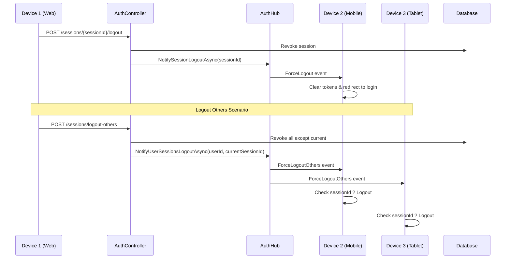

# ?? **Authentication Hub - SignalR Realtime Logout**

## ?? **T?ng quan**

SignalR Hub ?? x? lý các s? ki?n authentication realtime:
- ? **Force Logout** - ??ng xu?t thi?t b? t? xa
- ? **Logout Others** - ??ng xu?t t?t c? thi?t b? khác
- ? **Session Management** - Qu?n lý phiên ??ng nh?p

## ?? **Endpoints**

### **SignalR Hub**
```
/authhub - WebSocket connection endpoint
```

### **REST API**
```
GET    /api/Auth/sessions - Danh sách thi?t b? ?ang ??ng nh?p
POST   /api/Auth/sessions/{sessionId}/logout - ??ng xu?t 1 thi?t b?
POST   /api/Auth/sessions/logout-others - ??ng xu?t t?t c? thi?t b? khác
```

## ?? **Frontend Integration**

### **1. Angular/React/Vue - TypeScript**

#### **Install SignalR**
```bash
npm install @microsoft/signalr
```

#### **AuthHub Service**
```typescript
import { HubConnection, HubConnectionBuilder, LogLevel } from '@microsoft/signalR';

export class AuthHubService {
  private connection?: HubConnection;
  private accessToken: string = '';

  constructor() {}

  // ? Kh?i t?o connection sau khi ??ng nh?p
  async connect(token: string): Promise<void> {
    this.accessToken = token;

    this.connection = new HubConnectionBuilder()
      .withUrl('https://localhost:7100/authhub', {
        accessTokenFactory: () => this.accessToken
      })
      .withAutomaticReconnect()
      .configureLogging(LogLevel.Information)
      .build();

    // ? L?ng nghe s? ki?n ForceLogout (??ng xu?t thi?t b? này)
    this.connection.on('ForceLogout', (data) => {
      console.log('?? Force Logout:', data);
      this.handleForceLogout(data);
    });

    // ? L?ng nghe s? ki?n ForceLogoutOthers (??ng xu?t thi?t b? khác)
    this.connection.on('ForceLogoutOthers', (data) => {
      console.log('?? Logout Others:', data);
      this.handleLogoutOthers(data);
    });

    // Reconnection events
    this.connection.onreconnecting((error) => {
      console.log('?? Reconnecting AuthHub...', error);
    });

    this.connection.onreconnected((connectionId) => {
      console.log('? AuthHub reconnected:', connectionId);
    });

    this.connection.onclose((error) => {
      console.error('? AuthHub connection closed:', error);
    });

    try {
      await this.connection.start();
      console.log('? AuthHub connected');
    } catch (err) {
      console.error('? AuthHub connection failed:', err);
      throw err;
    }
  }

  // ? X? lý ForceLogout - ??ng xu?t thi?t b? này
  private handleForceLogout(data: any): void {
    console.warn('?? Thi?t b? này ?ã b? ??ng xu?t!', data);
    
    // Hi?n th? thông báo
    alert(`?? B?n ?ã b? ??ng xu?t!\n\nLý do: ${data.message}\n\nVui lòng ??ng nh?p l?i.`);
    
    // Xóa token
    localStorage.removeItem('accessToken');
    localStorage.removeItem('refreshToken');
    sessionStorage.clear();
    
    // Redirect v? trang login
    window.location.href = '/login?reason=force-logout';
  }

  // ? X? lý ForceLogoutOthers - Ki?m tra n?u thi?t b? này b? logout
  private handleLogoutOthers(data: any): void {
    // L?y sessionId t? JWT token
    const currentSessionId = this.getSessionIdFromToken(this.accessToken);
    
    // N?u sessionId hi?n t?i KHÔNG ph?i là excludeSessionId ? logout
    if (currentSessionId && currentSessionId !== data.excludeSessionId) {
      console.warn('?? Thi?t b? khác ?ã ??ng xu?t t?t c?!', data);
      this.handleForceLogout(data);
    } else {
      console.log('? Thi?t b? này ???c gi? l?i (current session)');
    }
  }

  // Helper: Parse JWT ?? l?y SessionId
  private getSessionIdFromToken(token: string): number | null {
    try {
      const payload = JSON.parse(atob(token.split('.')[1]));
      return payload.SessionId ? parseInt(payload.SessionId) : null;
    } catch {
      return null;
    }
  }

  // ? Disconnect khi logout
  async disconnect(): Promise<void> {
    if (this.connection) {
      await this.connection.stop();
      console.log('?? AuthHub disconnected');
    }
  }

  // ? Ping ?? keep alive
  async ping(): Promise<void> {
    if (this.connection?.state === 'Connected') {
      await this.connection.invoke('Ping');
    }
  }
}
```

#### **App Initialization**
```typescript
// app.component.ts ho?c auth.service.ts

export class AppComponent implements OnInit {
  private authHub = new AuthHubService();

  async ngOnInit() {
    // Sau khi ??ng nh?p thành công
    const token = localStorage.getItem('accessToken');
    if (token) {
      try {
        await this.authHub.connect(token);
      } catch (error) {
        console.error('Failed to connect AuthHub:', error);
      }
    }
  }

  async logout() {
    await this.authHub.disconnect();
    // Clear tokens và redirect...
  }
}
```

### **2. Vanilla JavaScript**

```html
<!-- Add SignalR library -->
<script src="https://cdn.jsdelivr.net/npm/@microsoft/signalr@latest/dist/browser/signalr.min.js"></script>

<script>
const authHub = {
  connection: null,
  accessToken: null,

  async connect(token) {
    this.accessToken = token;

    this.connection = new signalR.HubConnectionBuilder()
      .withUrl('https://localhost:7100/authhub', {
        accessTokenFactory: () => this.accessToken
      })
      .withAutomaticReconnect()
      .build();

    // Listen for ForceLogout event
    this.connection.on('ForceLogout', (data) => {
      console.warn('?? Force Logout:', data);
      alert(`B?n ?ã b? ??ng xu?t!\n\nLý do: ${data.message}`);
      
      // Clear storage
      localStorage.removeItem('accessToken');
      localStorage.removeItem('refreshToken');
      
      // Redirect to login
      window.location.href = '/login?reason=force-logout';
    });

    // Listen for ForceLogoutOthers event
    this.connection.on('ForceLogoutOthers', (data) => {
      const currentSessionId = this.getSessionIdFromToken(this.accessToken);
      
      if (currentSessionId && currentSessionId !== data.excludeSessionId) {
        console.warn('?? Logout Others triggered');
        this.connection.invoke('ForceLogout', data);
      }
    });

    await this.connection.start();
    console.log('? AuthHub connected');
  },

  getSessionIdFromToken(token) {
    try {
      const payload = JSON.parse(atob(token.split('.')[1]));
      return payload.SessionId ? parseInt(payload.SessionId) : null;
    } catch {
      return null;
    }
  },

  async disconnect() {
    if (this.connection) {
      await this.connection.stop();
      console.log('?? AuthHub disconnected');
    }
  }
};

// Initialize after login
document.addEventListener('DOMContentLoaded', async () => {
  const token = localStorage.getItem('accessToken');
  if (token) {
    await authHub.connect(token);
  }
});
</script>
```

## ?? **Flow Diagram**



## ?? **Usage Examples**

### **Qu?n lý thi?t b? UI**

```html
<div class="devices-list">
  <h3>Thi?t b? ?ang ??ng nh?p ({{ activeSessions.length }}/3)</h3>
  
  <div *ngFor="let session of activeSessions" class="device-card">
    <div class="device-info">
      <i class="icon" [ngClass]="getDeviceIcon(session.deviceInfo)"></i>
      <div>
        <strong>{{ session.deviceInfo }}</strong>
        <small>{{ session.ipAddress }}</small>
        <small>Truy c?p l?n cu?i: {{ session.lastAccessAt | date:'short' }}</small>
      </div>
    </div>
    
    <div class="actions">
      <span *ngIf="session.isCurrentSession" class="badge">Thi?t b? này</span>
      <button *ngIf="!session.isCurrentSession" 
              (click)="logoutDevice(session.sessionId)"
              class="btn btn-danger">
        ??ng xu?t
      </button>
    </div>
  </div>

  <button (click)="logoutOthers()" class="btn btn-warning">
    ?? ??ng xu?t t?t c? thi?t b? khác
  </button>
</div>
```

```typescript
export class DevicesComponent {
  activeSessions: any[] = [];

  async loadSessions() {
    const response = await fetch('/api/Auth/sessions', {
      headers: { 'Authorization': `Bearer ${this.token}` }
    });
    const data = await response.json();
    this.activeSessions = data.sessions;
  }

  async logoutDevice(sessionId: number) {
    if (confirm('B?n có ch?c mu?n ??ng xu?t thi?t b? này?')) {
      await fetch(`/api/Auth/sessions/${sessionId}/logout`, {
        method: 'POST',
        headers: { 'Authorization': `Bearer ${this.token}` }
      });
      
      await this.loadSessions(); // Reload list
      alert('? ?ã ??ng xu?t thi?t b?');
    }
  }

  async logoutOthers() {
    if (confirm('??ng xu?t T?T C? thi?t b? khác?\n\nCác thi?t b? khác s? b? ??ng xu?t ngay l?p t?c!')) {
      await fetch('/api/Auth/sessions/logout-others', {
        method: 'POST',
        headers: { 'Authorization': `Bearer ${this.token}` }
      });
      
      await this.loadSessions();
      alert('? ?ã ??ng xu?t t?t c? thi?t b? khác');
    }
  }
}
```

## ?? **Security Notes**

1. **JWT Token** ph?i có claim `SessionId` ?? tracking
2. **SignalR connection** s? d?ng same JWT token
3. **Force logout** ch? revoke session, không delete token (token v?n t?n t?i cho ??n h?t h?n)
4. **Frontend ph?i handle** vi?c clear tokens và redirect

## ?? **Testing**

```typescript
// Test ForceLogout
const testConnection = new signalR.HubConnectionBuilder()
  .withUrl('/authhub', { 
    accessTokenFactory: () => 'your-test-token' 
  })
  .build();

testConnection.on('ForceLogout', (data) => {
  console.log('Received ForceLogout:', data);
});

await testConnection.start();
```

## ? **Features**

- ? Realtime logout notification
- ? Multiple device management
- ? Auto-reconnect support
- ? Cross-platform (Web, Mobile, Desktop)
- ? Secure with JWT authentication
- ? Easy integration

**Ready to use! ??**
