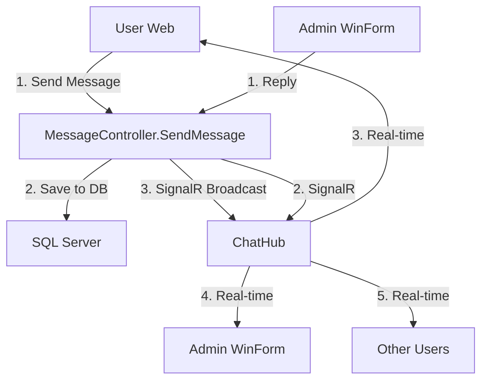

# 🚀 **HUIT Library Chat System với SignalR**

## 📋 **Tổng quan**

Hệ thống Chat Realtime hoàn chỉnh cho phép User và Admin chat với nhau thông qua:
- ✅ **SignalR Hub** - Realtime messaging  
- ✅ **REST API** - Message storage
- ✅ **JWT Authentication** - Security
- ✅ **Cross-platform** - Web + WinForms

## 🎯 **Endpoints**

### **Message API**
```
POST   /api/Message/send- Gửi tin nhắn
GET    /api/Message/history/{chatSessionId} - Lịch sử tin nhắn
GET    /api/Message/chat-sessions      - Danh sách phiên chat
```

### **SignalR Hub** 
```
/chathub - WebSocket connection endpoint
```

## 🔧 **Setup & Testing**

### **1. Frontend (JavaScript/TypeScript)**

#### **Installation**
```bash
npm install @microsoft/signalr
```

#### **Basic Connection**
```typescript
import { HubConnectionBuilder } from '@microsoft/signalr';

const connection = new HubConnectionBuilder()
    .withUrl('https://localhost:7100/chathub', {
        accessTokenFactory: () => 'your-jwt-token'
    })
    .build();

// Lắng nghe tin nhắn mới
connection.on('ReceiveMessage', (messageData) => {
    console.log('Tin nhắn mới:', messageData);
  // Update UI
});

await connection.start();
console.log('✅ Đã kết nối SignalR');
```

#### **Gửi tin nhắn**
```javascript
// Qua SignalR
await connection.invoke('SendMessage', 0, 'Hello Admin!'); // 0 = admin

// Hoặc qua REST API
fetch('/api/Message/send', {
    method: 'POST',
    headers: {
        'Authorization': 'Bearer ' + token,
        'Content-Type': 'application/json'
    },
    body: JSON.stringify({
        recipientId: 0,
     message: 'Hello from API!'
    })
});
```

### **2. WinForms (C# Admin App)**

#### **NuGet Package**
```xml
<PackageReference Include="Microsoft.AspNetCore.SignalR.Client" Version="8.0.0" />
```

#### **Connection Code**
```csharp
private HubConnection _hubConnection;

private async Task ConnectAsync()
{
    _hubConnection = new HubConnectionBuilder()
   .WithUrl("https://localhost:7100/chathub", options => {
       options.AccessTokenProvider = () => Task.FromResult(jwtToken);
        })
      .Build();

    _hubConnection.On<object>("ReceiveMessage", OnMessageReceived);
    
    await _hubConnection.StartAsync();
    MessageBox.Show("✅ Đã kết nối Chat Hub!");
}

private void OnMessageReceived(object messageData)
{
    // Parse và hiển thị tin nhắn
    Invoke(() => {
        txtChat.AppendText($"User: {messageData}\r\n");
    });
}
```

## 📊 **Message Flow**



## 🎮 **Usage Examples**

### **Chat Component (Angular)**
```html
<div class="chat-container">
    <div class="messages" #messagesContainer>
        <div *ngFor="let msg of messages" 
     [class]="msg.senderId === currentUserId ? 'sent' : 'received'">
            <strong>{{msg.senderName}}:</strong> {{msg.message}}
            <small>{{msg.timestamp | date:'short'}}</small>
        </div>
    </div>
    
    <div class="input-area">
    <input [(ngModel)]="newMessage" 
     (keyup.enter)="sendMessage()"
   placeholder="Nhập tin nhắn...">
   <button (click)="sendMessage()">📤</button>
    </div>
</div>
```

```typescript
export class ChatComponent {
    messages: any[] = [];
    newMessage = '';
    connection?: HubConnection;

    async ngOnInit() {
        await this.connectSignalR();
 await this.loadChatHistory();
    }

    async connectSignalR() {
        this.connection = new HubConnectionBuilder()
      .withUrl('/chathub', { 
            accessTokenFactory: () => this.authService.getToken()
            })
 .build();

        this.connection.on('ReceiveMessage', (msg) => {
     this.messages.push(msg);
 this.scrollToBottom();
        });

        await this.connection.start();
    }

    async sendMessage() {
     if (this.newMessage.trim()) {
      await this.connection?.invoke('SendMessage', 0, this.newMessage);
      this.newMessage = '';
        }
    }

    async loadChatHistory() {
        const response = await fetch('/api/Message/chat-sessions');
        const data = await response.json();
        // Load messages...
    }
}
```

### **WinForms Admin Panel**
```csharp
public partial class AdminChatForm : Form
{
    private HubConnection _connection;
    private List<ChatUser> _activeUsers = new();

    private async void AdminChatForm_Load(object sender, EventArgs e)
 {
        await SetupSignalRConnection();
        await LoadActiveUsers();
    }

    private async Task SetupSignalRConnection()
    {
    _connection = new HubConnectionBuilder()
          .WithUrl("https://localhost:7100/chathub", options =>
    {
         options.AccessTokenProvider = () => Task.FromResult(AuthToken);
            })
            .WithAutomaticReconnect()
            .Build();

        _connection.On<MessageData>("ReceiveMessage", OnNewMessage);
        _connection.On<UserInfo>("UserJoined", OnUserJoined);

        await _connection.StartAsync();
  lblStatus.Text = "✅ Kết nối thành công";
    }

    private void OnNewMessage(MessageData message)
    {
     this.Invoke(() =>
    {
       var chatText = $"[{message.Timestamp:HH:mm}] {message.SenderName}: {message.Content}\r\n";
          rtbChatHistory.AppendText(chatText);
            rtbChatHistory.ScrollToCaret();
       
            // Play notification sound
        SystemSounds.Asterisk.Play();
        });
    }

    private async void btnReply_Click(object sender, EventArgs e)
    {
        if (!string.IsNullOrWhiteSpace(txtReply.Text))
        {
     var selectedUser = (ChatUser)cbUsers.SelectedItem;
        await _connection.SendAsync("SendMessage", selectedUser.UserId, txtReply.Text);
        txtReply.Clear();
        }
    }
}
```

## 🔒 **Security Features**

- **JWT Authentication** required cho tất cả endpoints
- **Role-based access** (Admin có quyền đặc biệt)
- **Input validation** (message length, XSS protection)
- **Rate limiting** có thể implement
- **CORS configured** cho cross-origin requests

## 📈 **Performance & Scalability**

### **SignalR Configuration**
```csharp
// Program.cs
builder.Services.AddSignalR(options =>
{
    options.MaximumReceiveMessageSize = 1024 * 1024; // 1MB
  options.StreamBufferCapacity = 10;
    options.EnableDetailedErrors = true; // Dev only
});
```

### **Database Optimization**
```sql
-- Index cho performance
CREATE INDEX IX_TinNhan_PhienChat_ThoiGian 
ON TinNhan (MaPhienChat, ThoiGianGui DESC);

CREATE INDEX IX_TinNhan_NguoiGui_ThoiGian 
ON TinNhan (MaNguoiGui, ThoiGianGui DESC);
```

### **Redis Backplane** (cho scale-out)
```csharp
builder.Services.AddSignalR()
    .AddStackExchangeRedis("localhost:6379");
```

## 🧪 **Testing**

### **SignalR Connection Test**
```javascript
// Browser Console Test
const testConnection = new signalR.HubConnectionBuilder()
  .withUrl('/chathub', {
        accessTokenFactory: () => 'your-jwt-token'
    })
    .build();

testConnection.start().then(() => {
    console.log('✅ Connected!');
    testConnection.invoke('SendMessage', 0, 'Test from console');
});
```

### **REST API Test**
```bash
# Send Message
curl -X POST https://localhost:7100/api/Message/send \
  -H "Authorization: Bearer YOUR_JWT_TOKEN" \
  -H "Content-Type: application/json" \
  -d '{
    "recipientId": 0,
  "message": "Test message from cURL"
  }'

# Get Chat Sessions
curl -H "Authorization: Bearer YOUR_JWT_TOKEN" \
  https://localhost:7100/api/Message/chat-sessions
```

## 🐛 **Troubleshooting**

### **Connection Issues**
```javascript
connection.onreconnecting((error) => {
    console.log('🔄 Reconnecting...', error);
});

connection.onclose((error) => {
    console.error('❌ Connection lost:', error);
    // Implement retry logic
    setTimeout(() => connection.start(), 5000);
});
```

### **Common Issues**

1. **401 Unauthorized**
   - ✅ Kiểm tra JWT token
   - ✅ Token trong `access_token` query param hoặc Authorization header

2. **CORS Errors**
   - ✅ Configure CORS với `.AllowCredentials()`
   - ✅ Specific origins thay vì `*`

3. **Messages không realtime**
   - ✅ Kiểm tra SignalR connection status
   - ✅ Verify group membership (`User_1`, `AdminGroup`)

4. **Database Connection**
   - ✅ Check connection string
   - ✅ Verify Entity Framework context

## 📚 **API Documentation**

### **SendMessage Request**
```json
{
  "recipientId": 0,     // 0 = admin, >0 = specific user
  "message": "Hello!",  // 1-1000 characters
  "chatSessionId": 123  // optional
}
```

### **Message Response**
```json
{
  "id": 456,
  "chatSessionId": 123,
  "senderId": 789,
  "senderName": "John Doe",
  "message": "Hello!",
  "timestamp": "2024-11-18T10:30:00Z",
  "messageType": "ToAdmin"
}
```

## 🎉 **Ready to Use!**

Hệ thống Chat đã sẵn sàng sử dụng với đầy đủ tính năng:
- ✅ Real-time messaging
- ✅ User ↔ Admin communication  
- ✅ Web + WinForms support
- ✅ Message history
- ✅ Authentication & authorization
- ✅ Error handling & reconnection

**Happy Coding! 🚀**