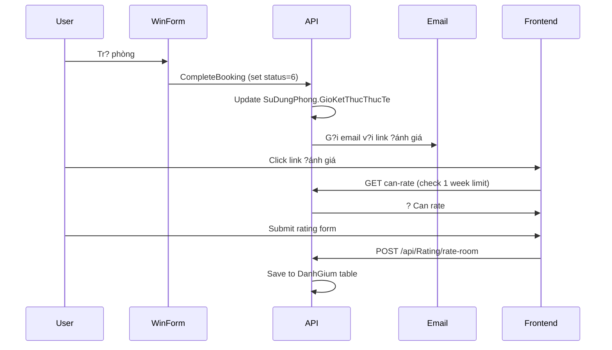

# ?? H? th?ng ?ánh giá Phòng HUIT Library (Version 2.0)

## ?? T?ng quan
H? th?ng ?ánh giá ?ã ???c c?p nh?t v?i model database m?i, ch? h? tr? **?ánh giá phòng** v?i các quy t?c kinh doanh ???c c?i thi?n.

## ??? Database Model

### DanhGium (Updated)
```csharp
public partial class DanhGium
{
    public int MaDanhGia { get; set; }        // Primary Key
    public int MaNguoiDung { get; set; }      // FK User
    public int MaDangKy { get; set; }         // FK Booking (NEW)
    public int MaPhong { get; set; }     // FK Room (NEW)
    public byte DiemDanhGia { get; set; }     // Rating 1-5
    public string? NoiDung { get; set; }      // Comment
    public DateTime NgayDanhGia { get; set; } // Rating date
}
```

### Thay ??i chính:
- ? Không còn `LoaiDoiTuong` và `MaDoiTuong`
- ? Thêm `MaDangKy` và `MaPhong` c? th?
- ? Ch? h? tr? ?ánh giá phòng
- ? Liên k?t tr?c ti?p v?i booking

## ?? API Endpoints (Updated)

### 1. T?o ?ánh giá phòng
```http
POST /api/Rating
Content-Type: application/json

{
  "loaiDoiTuong": "PHONG",// Fixed value
  "maDoiTuong": 123,   // MaPhong
  "diemDanhGia": 5,          // 1-5 stars
  "noiDung": "Phòng t?t...",    // Optional
  "maDangKy": 456       // Required - Booking ID
}
```

### 2. C?p nh?t ?ánh giá (trong 1 tu?n)
```http
PUT /api/Rating/{maDanhGia}
Content-Type: application/json

{
  "diemDanhGia": 4,
  "noiDung": "Updated comment..."
}
```

### 3. API ??c bi?t cho ?ánh giá phòng
```http
POST /api/Rating/rate-room
Content-Type: application/json

{
  "maDoiTuong": 123,     // MaPhong
  "diemDanhGia": 5,      // 1-5 stars  
  "noiDung": "Great!",   // Optional
  "maDangKy": 456        // Required
}
```

### 4. Xem ?ánh giá phòng
```http
GET /api/Rating/object/PHONG/{maPhong}?pageNumber=1&pageSize=10
```

### 5. Th?ng kê ?ánh giá phòng
```http
GET /api/Rating/statistics/PHONG/{maPhong}
```
**Response:**
```json
{
  "success": true,
  "data": {
    "loaiDoiTuong": "PHONG",
    "maDoiTuong": 123,
    "tenDoiTuong": "Phòng h?c 101",
    "tongSoDanhGia": 25,
    "diemTrungBinh": 4.2,
  "sao1": 1,
    "sao2": 2, 
    "sao3": 5,
    "sao4": 8,
    "sao5": 9
  }
}
```

### 6. Ki?m tra quy?n ?ánh giá
```http
GET /api/Rating/can-rate/PHONG/{maPhong}?maDangKy={bookingId}
```

## ?? Business Rules (Updated)

### 1. ?i?u ki?n ?ánh giá
- ? Ph?i ?ã **tr? phòng** (tr?ng thái = 6)
- ? Ch? trong vòng **1 tu?n** sau khi tr? phòng
- ? M?i user ch? 1 ?ánh giá/phòng/booking

### 2. Th?i gian gi?i h?n
- **?ánh giá**: 1 tu?n sau khi tr? phòng (d?a trên `SuDungPhong.GioKetThucThucTe`)
- **Ch?nh s?a**: 1 tu?n sau khi tr? phòng  
- **Xóa**: ? Không còn h? tr?

### 3. Tr?ng thái ??t phòng
```csharp
1 = Ch? duy?t
2 = ?ã duy?t  
3 = T? ch?i
4 = ?ang s? d?ng
5 = H?y
6 = ?ã tr? phòng ? (Required for rating)
```

## ?? Workflow Integration

### 1. Hoàn ch?nh booking ? ?ánh giá


### 2. Ki?m tra th?i gian ?ánh giá
```csharp
// Logic ki?m tra 1 tu?n
var usage = await _context.SuDungPhongs
    .FirstOrDefaultAsync(su => su.MaDangKy == maDangKy);

var daysSinceCompleted = (GetVietnamTime() - usage.GioKetThucThucTe.Value).TotalDays;
if (daysSinceCompleted > 7)
    return (false, "Ch? có th? ?ánh giá trong vòng 1 tu?n sau khi tr? phòng");
```

## ?? Data Relations

### 1. Liên k?t d? li?u
```sql
DanhGium
??? MaNguoiDung ? NguoiDung.MaNguoiDung
??? MaDangKy ? DangKyPhong.MaDangKy  
??? MaPhong ? Phong.MaPhong

-- Join queries
SELECT r.*, p.TenPhong, u.HoTen, dk.ThoiGianBatDau
FROM DanhGia r
JOIN Phong p ON r.MaPhong = p.MaPhong
JOIN NguoiDung u ON r.MaNguoiDung = u.MaNguoiDung  
JOIN DangKyPhong dk ON r.MaDangKy = dk.MaDangKy
```

### 2. Validation Logic
```csharp
// Ki?m tra user ?ã tr? phòng này ch?a
var booking = await _context.DangKyPhongs
    .FirstOrDefaultAsync(dk => 
  dk.MaDangKy == maDangKy && 
        dk.MaNguoiDung == userId && 
        dk.MaPhong == maPhong &&
        dk.MaTrangThai == 6); // ?ã tr? phòng

// Ki?m tra ?ã ?ánh giá ch?a
var existingRating = await _context.DanhGia
    .FirstOrDefaultAsync(d => 
        d.MaNguoiDung == userId && 
   d.MaPhong == maPhong &&
        d.MaDangKy == maDangKy);
```

## ??? Technical Notes

### 1. Data Types
- `DiemDanhGia`: `byte` (1-5)
- `NgayDanhGia`: `DateTime` (Vietnam timezone)
- `MaDangKy`, `MaPhong`: `int` (required)

### 2. Error Handling
```json
{
  "success": false,
  "message": "Ch? có th? ?ánh giá trong vòng 1 tu?n sau khi tr? phòng. B?n ?ã tr? phòng 10 ngày tr??c."
}
```

### 3. Navigation Properties
```csharp
rating.MaDangKyNavigation  // ? DangKyPhong
rating.MaPhongNavigation   // ? Phong  
rating.MaNguoiDungNavigation // ? NguoiDung
```

## ?? Integration Points

### 1. Email t? BookingService
```csharp
// Trong CompleteBookingAsync
var reviewLink = $"{reviewUrl}?maDangKy={maDangKy}&maPhong={booking.MaPhong}";
```

### 2. Frontend Detection
```javascript
// Check if can rate
const canRate = await fetch(`/api/Rating/can-rate/PHONG/${roomId}?maDangKy=${bookingId}`);

// Submit rating
const result = await fetch('/api/Rating/rate-room', {
method: 'POST',
  body: JSON.stringify({
    maDoiTuong: roomId,
diemDanhGia: stars,
noiDung: comment,
maDangKy: bookingId
  })
});
```

## ?? Migration Notes

### Thay ??i t? version c?:
1. ? Không còn h? tr? `DICH_VU`, `NHAN_VIEN`
2. ? Không còn API xóa ?ánh giá
3. ? Model m?i v?i `MaDangKy` + `MaPhong`
4. ? Logic th?i gian d?a trên tr? phòng th?c t?
5. ? Validation ch?t ch? h?n

### Breaking Changes:
- API request format thay ??i
- Database schema m?i
- Business logic khác

## ?? Testing

### Test Cases:
1. ? User ?ã tr? phòng trong 7 ngày ? Can rate
2. ? User ?ã tr? phòng > 7 ngày ? Cannot rate  
3. ? User ch?a tr? phòng ? Cannot rate
4. ? User ?ã ?ánh giá r?i ? Cannot rate again
5. ? User có th? s?a ?ánh giá trong 7 ngày
6. ? User không th? s?a ?ánh giá > 7 ngày

---

## ?? Important Notes

1. **Restart Required**: Sau khi c?p nh?t code, c?n restart ?ng d?ng ?? Swagger c?p nh?t
2. **Database Migration**: C?n ch?y migration ?? c?p nh?t schema
3. **Frontend Update**: Angular c?n c?p nh?t ?? s? d?ng API m?i
4. **Email Templates**: C?p nh?t link trong email ?? tr? ?úng form ?ánh giá

## ?? Benefits

- ? ??n gi?n hóa logic (ch? phòng)
- ? Liên k?t d? li?u ch?t ch?
- ? Validation chính xác h?n
- ? Performance t?t h?n (ít join)
- ? D? maintain và extend